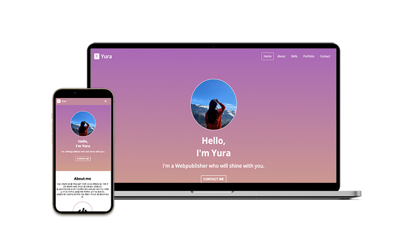

# Poltfolio

- https://cogcod.github.io/Portfolio/

 

## 작업목표
- HTML과 CSS를 사용한 견고한 마크업 작성 
- 미디어 쿼리를 이용한 반응형 사이트 구축 
- Vanila JavaScript만을 이용한 동적 로직 구현 
- 쉬운 업데이트 및 유지보수가 가능한 포트폴리오 페이지 구축

 

## 사용기술 
- HTML
- CSS
- Media Query 
- Vanila JavaScript

 

## Advanced Feature 
- 미디어 쿼리를 이용한 네비게이션 바 재배치 

